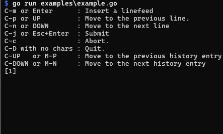

go-multiline-ny
===============

[](https://pkg.go.dev/github.com/hymkor/go-multiline-ny)

This is the readline package that supports multiline input and extends [go-readline-ny] with new keybindings. It is compatible with Emacs.

| Key | Feature
|-----|---------
| Ctrl-M or Enter | Insert a new line[^Y]
| Ctrl-J/Enter or Escape-Enter | Submit all lines
| Ctrl-P or Up   | Move cursor to previous line or last line of previous set of inputs in history
| Ctrl-N or Down | Move cursor to next line or first line of next set of inputs in history
| Alt-P or Ctrl-Up | Fetch the previous lines-set of the history
| Alt-N or Ctrl-Down | Fetch the next lines-set of the history
| Ctrl-Y | Paste the string in the clipboard
| Ctrl-R | Incremental search

[go-readline-ny]: https://github.com/nyaosorg/go-readline-ny
[^Y]: It is possible to give the condition to submit.

[Example](./examples/example.go)
---------



```examples/example.go
package main

import (
    "context"
    "fmt"
    "io"
    "os"
    "regexp"
    "strings"

    "github.com/mattn/go-colorable"

    "github.com/nyaosorg/go-readline-ny"
    "github.com/nyaosorg/go-readline-ny/simplehistory"

    "github.com/hymkor/go-multiline-ny"
)

func main() {
    ctx := context.Background()
    fmt.Println("C-m or Enter      : Insert a linefeed")
    fmt.Println("C-p or UP         : Move to the previous line.")
    fmt.Println("C-n or DOWN       : Move to the next line")
    fmt.Println("C-j or Esc+Enter  : Submit")
    fmt.Println("C-c               : Abort.")
    fmt.Println("C-D with no chars : Quit.")
    fmt.Println("C-UP   or M-P     : Move to the previous history entry")
    fmt.Println("C-DOWN or M-N     : Move to the next history entry")

    var ed multiline.Editor
    ed.SetPrompt(func(w io.Writer, lnum int) (int, error) {
        return fmt.Fprintf(w, "[%d] ", lnum+1)
    })
    ed.SetPredictColor(readline.PredictColorBlueItalic)

    ed.Highlight = []readline.Highlight{
        // Words -> dark green
        {Pattern: regexp.MustCompile(`(?i)(SELECT|INSERT|FROM|WHERE|AS)`), Sequence: "\x1B[33;49;22m"},
        // Double quotation -> light magenta
        {Pattern: regexp.MustCompile(`(?m)"([^"\n]*\\")*[^"\n]*$|"([^"\n]*\\")*[^"\n]*"`), Sequence: "\x1B[32;49;1m"},
        // Single quotation -> light red
        {Pattern: regexp.MustCompile(`(?m)'([^'\n]*\\')*[^'\n]*$|'([^'\n]*\\')*[^'\n]*'`), Sequence: "\x1B[31;49;1m"},
        // Number literal -> light blue
        {Pattern: regexp.MustCompile(`[0-9]+`), Sequence: "\x1B[34;49;1m"},
        // Comment -> dark gray
        {Pattern: regexp.MustCompile(`(?s)/\*.*?\*/`), Sequence: "\x1B[30;49;1m"},
        // Multiline string literal -> dark red
        {Pattern: regexp.MustCompile("(?s)```.*?```"), Sequence: "\x1B[31;49;22m"},
    }
    ed.ResetColor = "\x1B[0m"
    ed.DefaultColor = "\x1B[37;49;1m"

    // To enable escape sequence on Windows.
    // (On other operating systems, it can be ommited)
    ed.SetWriter(colorable.NewColorableStdout())

    history := simplehistory.New()
    ed.SetHistory(history)
    ed.SetHistoryCycling(true)

    for {
        lines, err := ed.Read(ctx)
        if err != nil {
            fmt.Fprintln(os.Stderr, err.Error())
            return
        }
        L := strings.Join(lines, "\n")
        fmt.Println("-----")
        fmt.Println(L)
        fmt.Println("-----")
        history.Add(L)
    }
}
```

[Terminate input only if you type Enter when it ends with a semicolon](./examples/example-semi.go)
---------

```examples/example-semi.go
package main

import (
    "context"
    "fmt"
    "io"
    "os"
    "strings"

    "github.com/atotto/clipboard"
    "github.com/mattn/go-colorable"

    "github.com/nyaosorg/go-readline-ny/simplehistory"

    "github.com/hymkor/go-multiline-ny"
)

type OSClipboard struct{}

func (OSClipboard) Read() (string, error) {
    return clipboard.ReadAll()
}

func (OSClipboard) Write(s string) error {
    return clipboard.WriteAll(s)
}

func main() {
    ctx := context.Background()
    fmt.Println("C-m or Enter      : Submit when lines end with `;`")
    fmt.Println("                    Otherwise insert a linefeed.")
    fmt.Println("C-j               : Submit always")
    fmt.Println("C-c               : Abort.")
    fmt.Println("C-D with no chars : Quit.")

    var ed multiline.Editor
    ed.SetPrompt(func(w io.Writer, lnum int) (int, error) {
        return fmt.Fprintf(w, "[%d] ", lnum+1)
    })

    ed.SubmitOnEnterWhen(func(lines []string, _ int) bool {
        return strings.HasSuffix(strings.TrimSpace(lines[len(lines)-1]), ";")
    })

    // To enable escape sequence on Windows.
    // (On other operating systems, it can be ommited)
    ed.SetWriter(colorable.NewColorableStdout())

    // Use the clipboard of the operating system.
    ed.LineEditor.Clipboard = OSClipboard{}

    history := simplehistory.New()
    ed.SetHistory(history)
    ed.SetHistoryCycling(true)

    for {
        lines, err := ed.Read(ctx)
        if err != nil {
            fmt.Fprintln(os.Stderr, err.Error())
            return
        }
        L := strings.Join(lines, "\n")
        fmt.Println("-----")
        fmt.Println(L)
        fmt.Println("-----")
        history.Add(L)
    }
}
```

Acknowledgements
----------------

- [@spiegel-im-spiegel](https://github.com/spiegel-im-spiegel)
- [@apstndb](https://github.com/apstndb)

Release notes
-------------

- [Release notes (English)](./release_note_en.md)
- [Release notes (Japanese)](./release_note_ja.md)
